# Cluster Consul Installation

## First i install consul, using brew

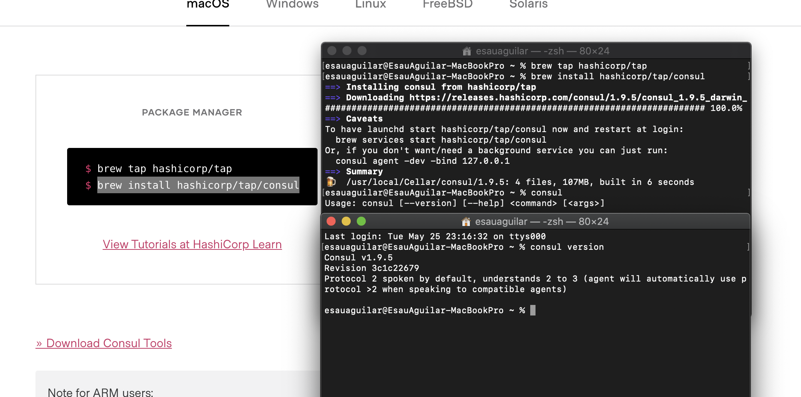

## I created the infrastructure on azure
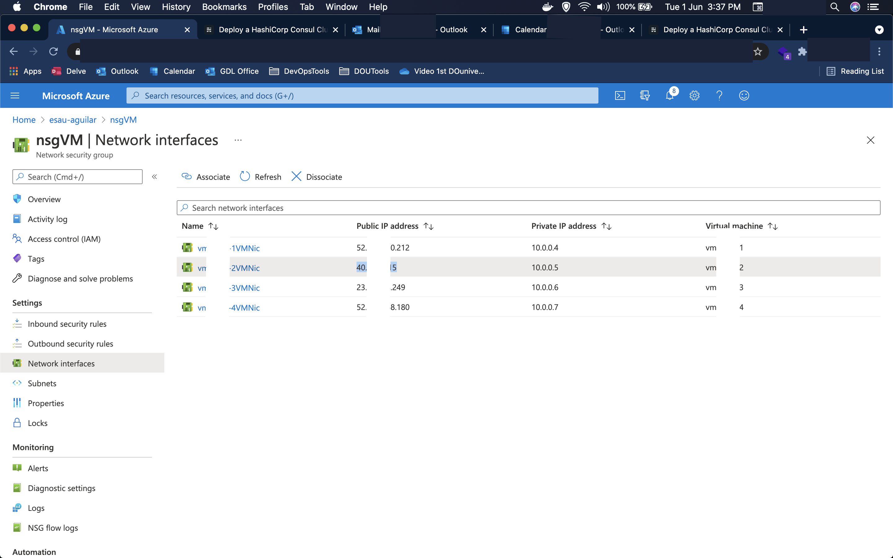

## Here I generated consul keygen, and tls files
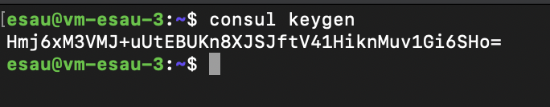
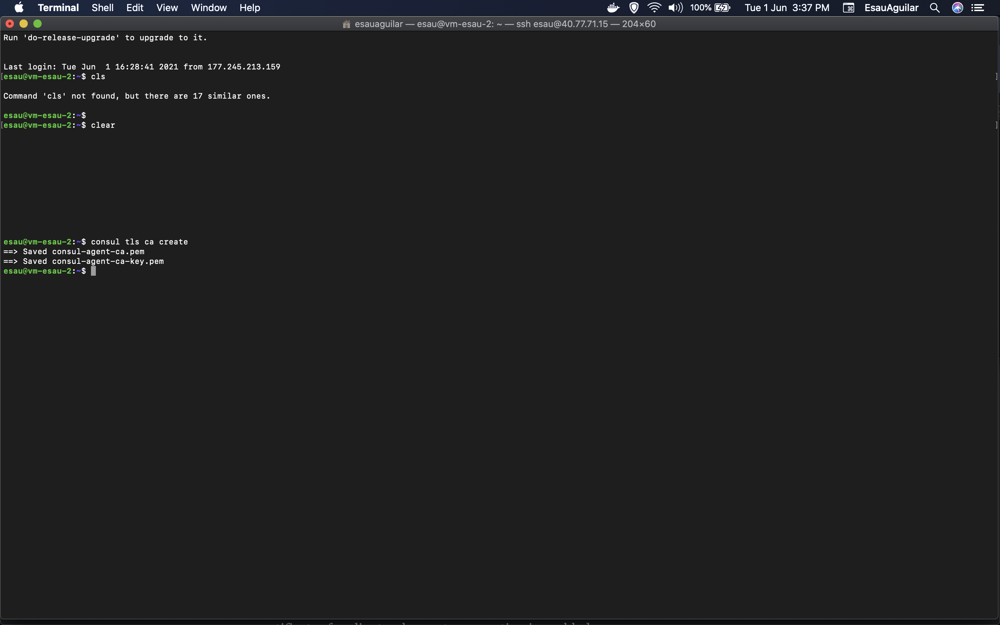
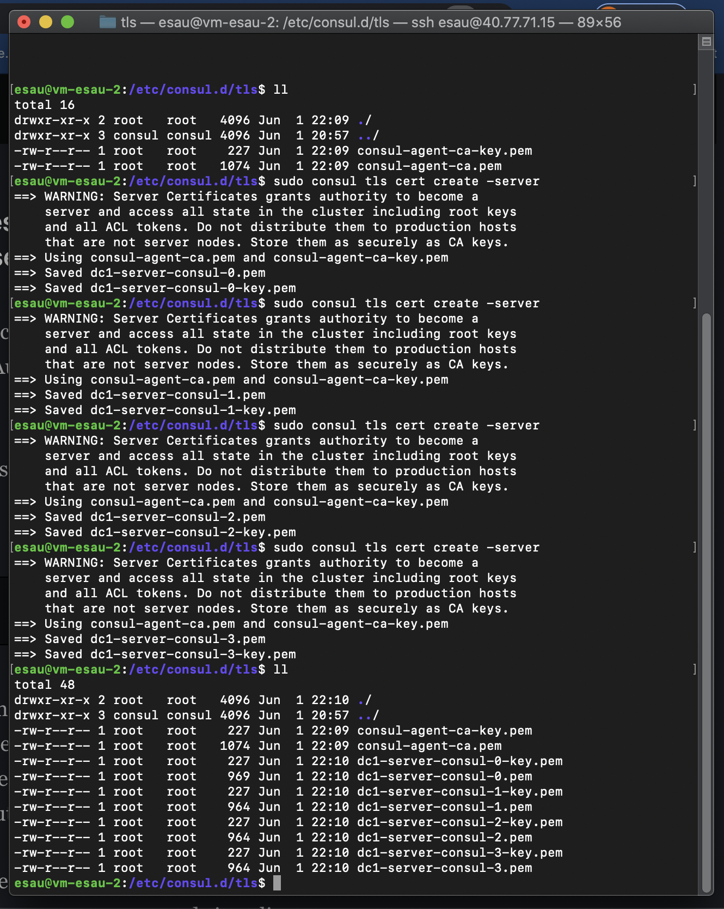

## I copied the files to my local machine to copy these to the vm where corresponds, using ansible
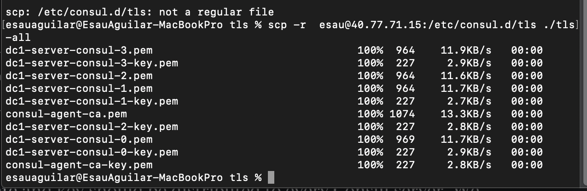

## Here we can see the files on local machine in sublime text
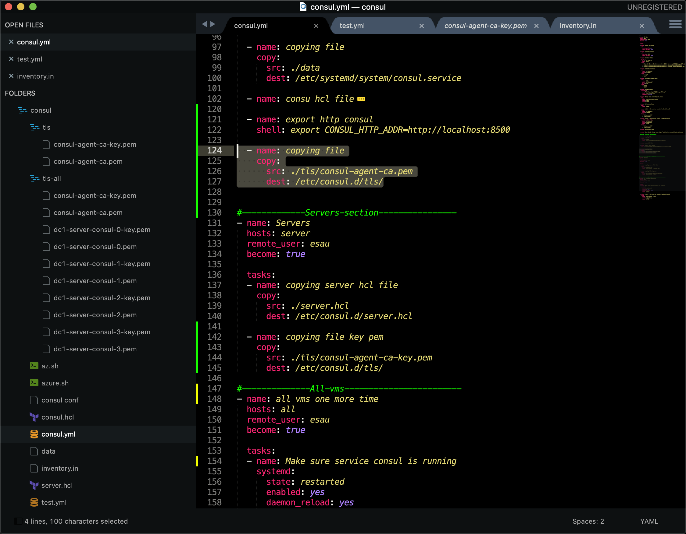

## I executed the ansible playbook
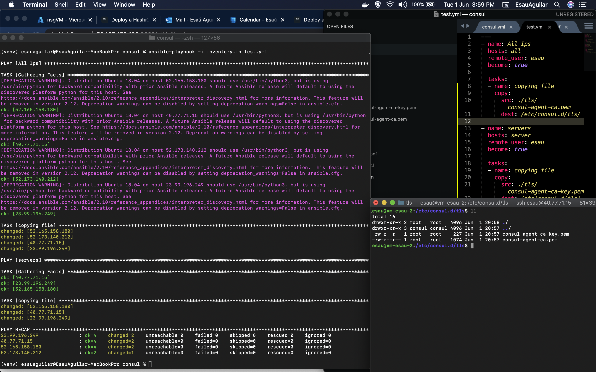

## In this step is executed the bootstrap commands, but the client never shows a good functioning
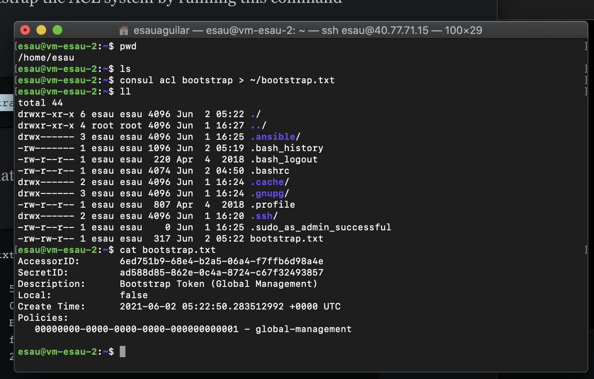
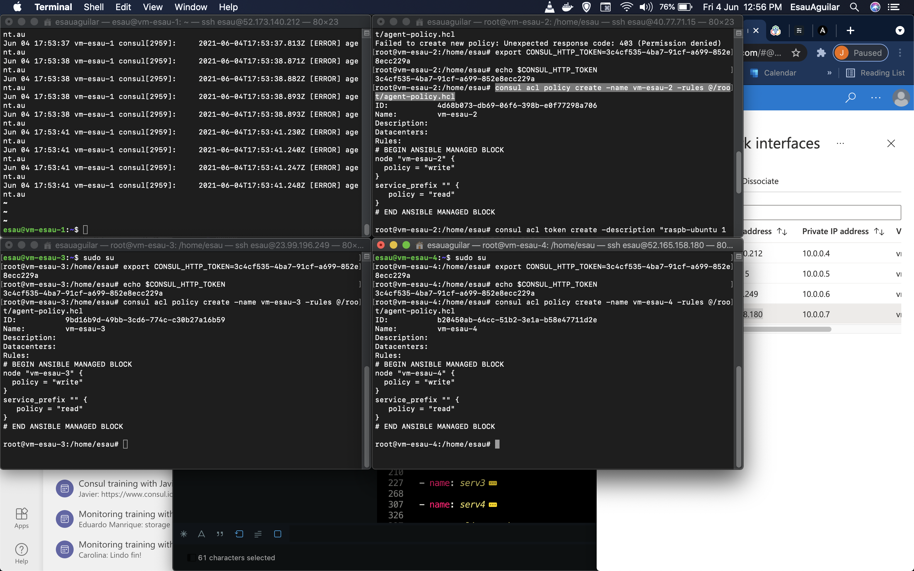
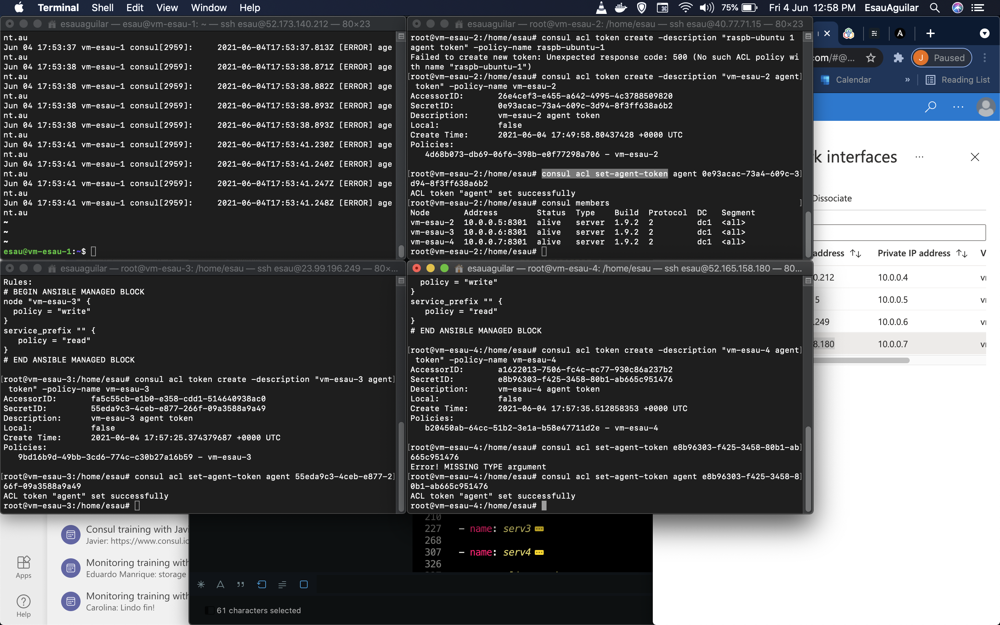
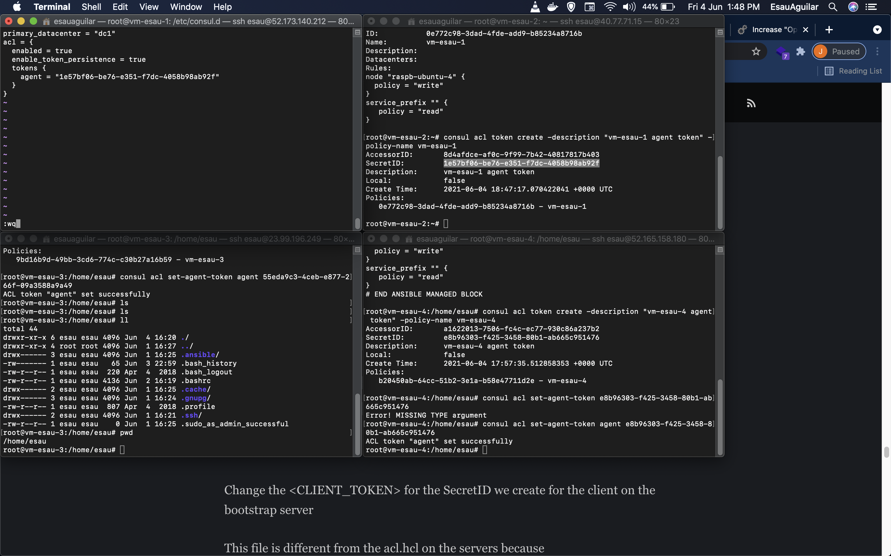